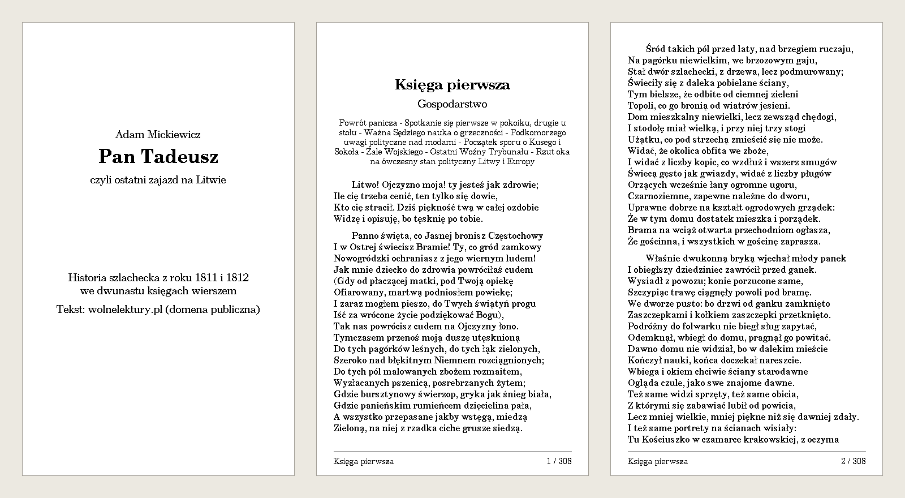
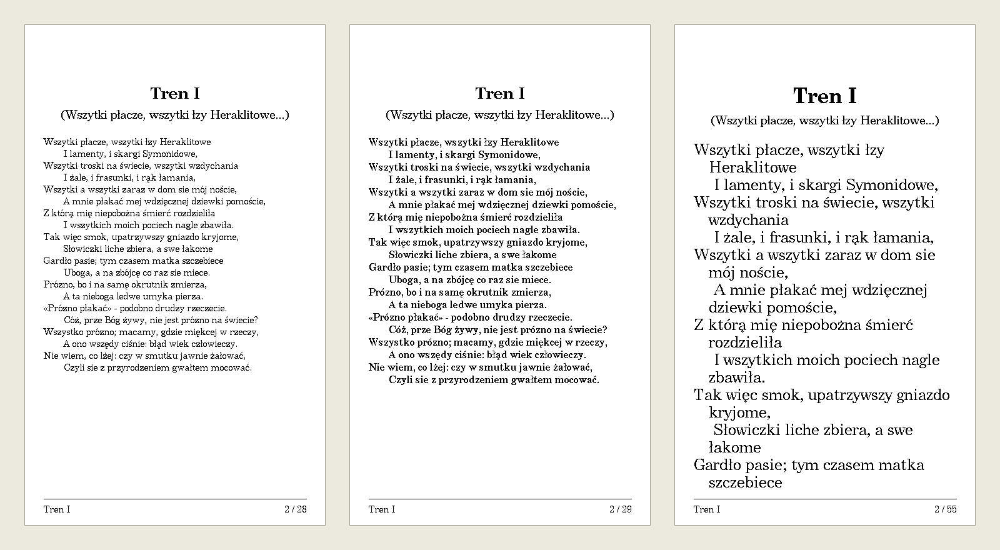
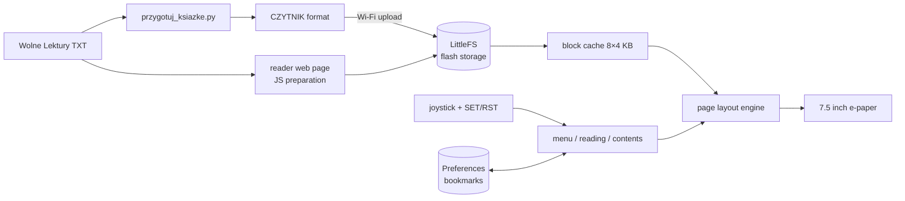
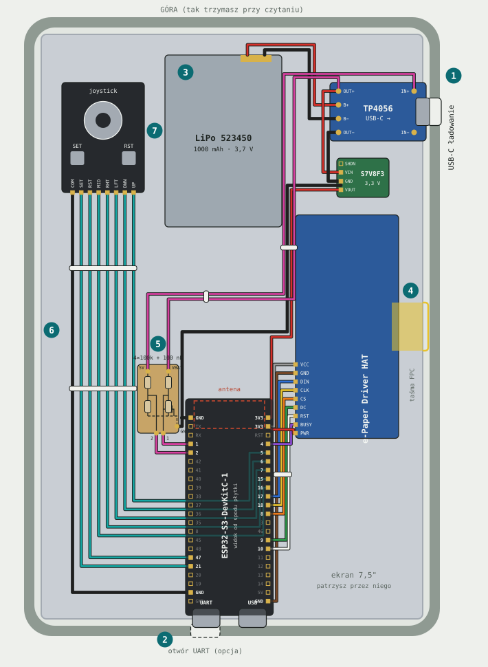
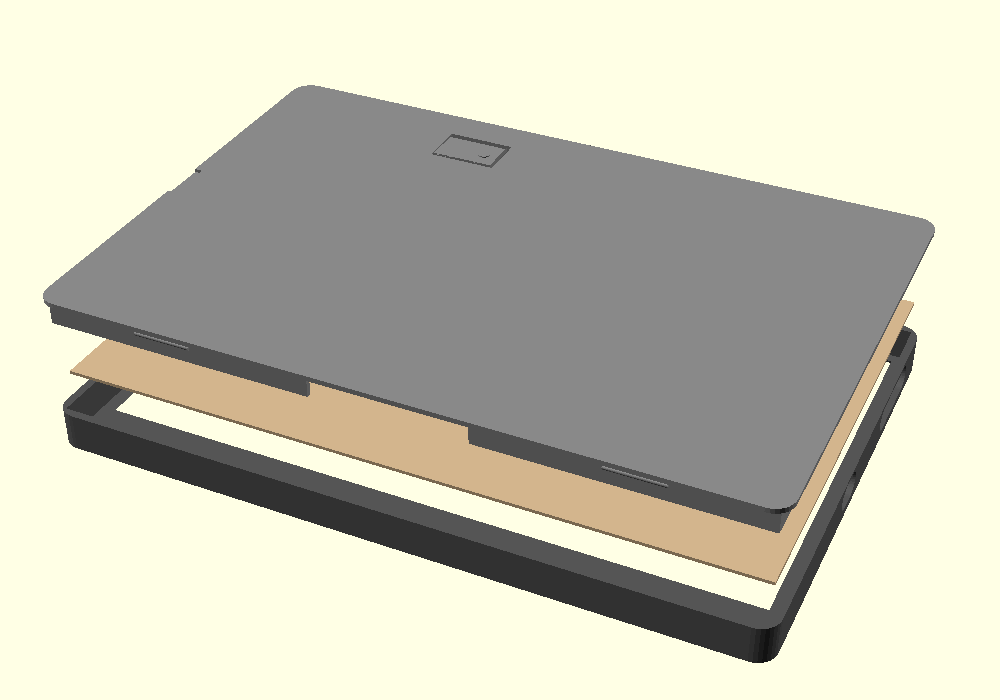

# 📖 DIY E-Paper E-Book Reader

🇬🇧 **English** · 🇵🇱 [Polski](README.pl.md)

[](https://github.com/PawelWozniak1/eink-ebook-reader/actions/workflows/tests.yml)

An e-book reader built from scratch. A Python pipeline prepares the books, firmware with its own page layout engine runs on an ESP32-S3, and the case was designed in OpenSCAD and 3D-printed.



<sub>Pages rendered by the Python simulator with the device's own bitmap fonts: title page, a chapter opening with subtitle and summary, and a regular page with footer.</sub>

---

## ✨ Features

- **Real typesetting:** justified prose paragraphs, indentation, wrapping of over-long verse lines, preserved stanza breaks in poetry
- **Automatic prose vs. poetry detection** based on line-length statistics
- **Chapters and table of contents:** every chapter starts on a new page, navigated with a joystick
- **4 font sizes** with full Polish character support; after a size change the reader stays at the same place in the text
- **Bookmarks:** the reader remembers your position in every book, even after a power cut
- **Power saving:** deep sleep after 30 minutes of inactivity or on a long button press; waking up goes straight back to the last page
- **Battery status** in the library menu: percentage, or a lightning bolt while charging; automatic sleep when the battery runs flat
- **Wi-Fi mode:** a web page for uploading and deleting books and for over-the-air (OTA) firmware updates, no cable needed
- **Captive portal:** with no home network available, the reader starts its own access point and phones open its page automatically
- **Bonus: tic-tac-toe** for two phones, with the board drawn on the e-paper 🎮

---

## 🐍 Python: book preparation pipeline

[`przygotuj_ksiazke.py`](tools/przygotuj_ksiazke.py) ("prepare book") converts raw TXT files from [Wolne Lektury](https://wolnelektury.pl) (a Polish public-domain library) into a lightweight format the reader understands.

```bash
python tools/przygotuj_ksiazke.py
```
```
Pan Tadeusz: 10742 linii, 479913 bajtów -> books/prepared/pan_tadeusz.txt
Treny: 699 linii, 28279 bajtów -> books/prepared/treny.txt
```

What the script does:

| Step | How |
|---|---|
| Strips the license footer | finds the `-----` separator |
| Detects the books (chapters) of *Pan Tadeusz* | a regular expression for "Księga pierwsza … dwunasta" and "Epilog" |
| Tells a chapter subtitle from its summary | heuristic based on line length and indentation |
| Assembles *Treny* from 20 separate files | `pathlib.glob` plus splitting each heading into title and subtitle |
| Generates a title page | a function taking `*args` for any number of subtitles |
| Adapts the text to microcontroller fonts | a replacement table for typographic characters (`—`, `„`, `…`) |
| Normalizes whitespace | collapses blank lines, forces LF line endings, UTF-8 |

Adding a new book takes one entry in the `KSIAZKI` list and a function that returns a list of lines.

The same logic is also ported to JavaScript on the reader's web page ([`strona.h`](firmware/czytnik/strona.h)), so a plain TXT file can be uploaded straight from a phone. The Python script handles the unusual structure of *Pan Tadeusz* and *Treny* better.

### Book file format

The first line is a header. In the text after it, the first byte of each line can be a control marker:

```
#CZYTNIK|Pan Tadeusz|Adam Mickiewicz
\004Pan Tadeusz
\001Księga pierwsza
\002Gospodarstwo
\003Powrót panicza - Spotkanie się pierwsze w pokoiku, drugie u stołu - ...

    Litwo! Ojczyzno moja! ty jesteś jak zdrowie:
```

| Marker | Meaning |
|---|---|
| `\001` | chapter title (always starts a new page) |
| `\002` | chapter subtitle |
| `\003` | chapter summary (smaller font, wrapped) |
| `\004` | large title (title page) |
| `\005` | centered text |
| `\006` | prose paragraph (indented and justified) |
| *(none)* | line of verse |
| empty line | gap between stanzas |

The format is deliberately simple. The reader doesn't have to parse HTML or EPUB, and a single pass over the file is enough to find the chapters and split the text into pages.

---

## 🖥️ Python: reader simulator

[`tools/symulator/`](tools/symulator/) renders a book exactly as the device shows it and saves the pages as PNG files. It is a Python port of the firmware's layout engine, so you can check how a book looks without flashing anything.

```bash
pip install -r requirements.txt
python tools/symulator/czytnik.py books/prepared/pan_tadeusz.txt -s 0 1 2 -m preview.png
```
```
Pan Tadeusz: 308 stron, 13 rozdziałów, wiersz, czcionka średnia
-> preview.png
```



<sub>Tren I at the small, medium and extra-large font sizes. Over-long verse lines wrap with a hanging indent, and the page count in the footer changes with the font size.</sub>

How it works:

- **u8g2 font decoder** ([`u8g2_font.py`](tools/symulator/u8g2_font.py)). The fonts in the firmware are bitmap fonts stored as bit-level run-length encoded byte arrays inside a C source file. The decoder parses C string literals (octal and hex escapes), reads the 23-byte header, finds glyphs via the ASCII lists and the Unicode jump table, and unpacks the RLE bitmaps. Text width follows the library's quirks exactly, e.g. the last glyph counts with its bitmap width, not its advance.
- **Layout engine port** ([`czytnik.py`](tools/symulator/czytnik.py)). The code mirrors `ulozStrone`, `podzielNaStrony` and `rysujStrone` from the firmware and works on UTF-8 byte offsets like the C++ code does. Bookmark positions saved by the device therefore point at the same place in the simulator.
- **CLI** built with `argparse`: pick pages, a font size, an output folder, or a single side-by-side montage.
- **Tests** ([`tests/`](tests/)) run on GitHub Actions. They cover the bit reader, the C literal parser, Polish glyphs in every font, text measurement, and pagination invariants: pages cover the whole text, every chapter starts a new page, and a larger font gives more pages.

The images in this README are generated with `python tools/symulator/zrzuty_do_readme.py`.

---

## 🔌 Firmware

The Arduino code lives in [`firmware/czytnik/`](firmware/czytnik/), about 1,900 lines of C++, HTML and JavaScript:

| File | What's inside |
|---|---|
| [`czytnik.ino`](firmware/czytnik/czytnik.ino) | main loop, buttons, block cache, layout engine, justification, menu, table of contents, bookmarks, deep sleep |
| [`bateria.ino`](firmware/czytnik/bateria.ino) | battery voltage via ADC, percentage from a LiPo discharge curve, charger detection, deep-discharge protection |
| [`siec.ino`](firmware/czytnik/siec.ino) | Wi-Fi (home network or own access point), web server, book upload and delete, firmware upload, ArduinoOTA, captive portal |
| [`strona.h`](firmware/czytnik/strona.h) | the upload web page (HTML/CSS/JS in `PROGMEM`), including the JS port of the book preparation |
| [`gra.ino`](firmware/czytnik/gra.ino) / [`gra.h`](firmware/czytnik/gra.h) | tic-tac-toe for two phones: game state, player slots with timeouts, board drawn on the e-paper |

---

## 🏗️ Architecture



### Firmware highlights

- **Books larger than RAM:** *Pan Tadeusz* is about 480 KB, so the text is read from flash in 4 KB blocks and the 8 most recently used blocks are kept in an LRU cache.
- **Custom text measurement:** asking the graphics library to measure every word was too slow, so glyph advance widths (up to U+017F, which covers all Polish letters) are computed once and cached for each font.
- **Re-pagination:** when the font size changes, the whole book is split into pages again and the reader returns to the same position in the text, not the same page number.
- **Bookmarks in NVS:** `Preferences` keys are limited to 15 characters, so file names are hashed with FNV-1a. Bookmarks from an older firmware version are migrated automatically.
- **Safe uploads:** an uploaded file is written under a temporary name and only swapped in once complete, so an interrupted upload never corrupts an existing book. File names are sanitized to `a-z0-9_-`.
- **E-paper refresh strategy:** fast partial refresh when turning pages and a full refresh every 20 pages to clear ghosting.

---

## 🔧 Hardware

| Part | Model |
|---|---|
| Microcontroller | ESP32-S3-DevKitC-1 |
| Display | Waveshare e-Paper 7.5" 800×480 (GDEY075T7) + HAT |
| Controls | 5-way joystick + SET + RST |
| Power | LiPo 523450 1000 mAh + TP4056 USB-C charger + Pololu S7V8F3 (3.3 V buck-boost) |

<details>
<summary>Wiring</summary>

| Signal | GPIO |
|---|---|
| e-paper CS / DC / RST / BUSY | 8 / 9 / 10 / 4 |
| e-paper SCK / MOSI | 18 / 17 |
| UP / DWN / LFT / RHT / MID | 5 / 6 / 7 / 15 / 16 |
| SET / RST | 21 / 47 |
| battery voltage (100k/100k divider from TP4056 OUT+) | 1 |
| charger present (100k/100k divider from TP4056 IN+) | 2 |

Buttons pull to GND (internal pull-ups). Newer HATs have a 9th pin, PWR: it goes to 3V3 together with VCC, so the display is always powered.

Power path: battery → TP4056 (B+/B−) → OUT+/OUT− → Pololu S7V8F3 (VIN/GND) → VOUT to the ESP32 **3V3** pin. The 5V pin stays unconnected. Unplug the battery before flashing over USB.

The battery dividers are optional: without them the reader works, it just doesn't show the battery level. How to build them (in Polish): [`docs/dzielnik_baterii.md`](docs/dzielnik_baterii.md).
</details>

<details>
<summary>Layout inside the case</summary>

The reader is held in portrait. Positions are given from the front, as you look at the text:

| Part | Where |
|---|---|
| joystick (with SET and RST) | in the back cover, top left, stick facing out |
| TP4056 | right edge, top, USB-C port in the right wall |
| Pololu converter | lying flat below the charger, pins towards the middle |
| battery | top, between the joystick and the charger |
| HAT | right edge, level with the FPC ribbon (middle of the panel's right edge) |
| ESP32 | bottom centre, USB ports in the bottom wall, antenna up |
| dividers | on a small board right next to GPIO1 and GPIO2 |

The button wires run down the left edge as one bundle and pass under the ESP board to its right header, so the ESP sits on its headers with 2–3 mm of clearance. Routing rules and the full connection table (in Polish): [`docs/okablowanie.md`](docs/okablowanie.md).


</details>

### Controls

| Button | Reading | Menu | Contents |
|---|---|---|---|
| UP / DWN | previous / next page | select book | select chapter |
| LFT | chapter start / previous chapter | last read book | back |
| RHT | next chapter | open | go to |
| MID | menu (hold: sleep) | open | go to |
| SET | table of contents | — | back |
| RST | font size | — | — |

---

## 🖨️ Case



A parametric OpenSCAD design: [`czytnik_eink.scad`](hardware/case/czytnik_eink.scad). Every dimension is a variable: panel size, tolerances, positions of the battery, ESP32 and charger, the USB-C ports and the rear button. That makes it easy to adapt the case to a different display.

It prints as three parts: the front bezel, a support plate behind the panel and the back cover. Ready-made STL and OBJ files are included.

> The case design still follows the earlier electronics layout. The new one (joystick in the back cover, charging port in the right wall, ESP at the bottom) is described in [`docs/okablowanie.md`](docs/okablowanie.md).

---

## 🚀 Getting started

1. **Arduino IDE** with ESP32 support and the `GxEPD2` and `U8g2_for_Adafruit_GFX` libraries.
2. Board: *ESP32S3 Dev Module*. Pick a **Partition Scheme** with OTA and SPIFFS, e.g. *Default 4MB with spiffs (1.2MB APP/1.5MB SPIFFS)*.
3. Flash the sketch from [`firmware/czytnik/`](firmware/czytnik/).
4. Prepare the books: `python tools/przygotuj_ksiazke.py`. Optionally preview them with the simulator.
5. On the reader, choose **Wgraj książki (WiFi)** ("Upload books"), open the address shown on screen (or `http://czytnik.local`) and upload the files from `books/prepared/`.

Later firmware versions can be uploaded through the same page (a `.bin` file) or from the Arduino IDE over the network port.

---

## 📁 Project structure

```
├── books/
│   ├── source/                    # input: Wolne Lektury TXT (Pan Tadeusz, 20 Treny files)
│   └── prepared/                  # output: #CZYTNIK format, ready to upload
├── tools/
│   ├── przygotuj_ksiazke.py       # Python: source TXT -> reader format
│   ├── okablowanie.py             # generates docs/okablowanie.svg and .md
│   └── symulator/
│       ├── czytnik.py             # layout engine port + CLI
│       ├── u8g2_font.py           # u8g2 bitmap font decoder
│       ├── fonty/                 # the 6 fonts used by the firmware
│       └── zrzuty_do_readme.py    # regenerates docs/*.png
├── firmware/czytnik/              # Arduino sketch (open czytnik.ino)
│   ├── czytnik.ino                # main program: layout, menu, bookmarks, sleep
│   ├── bateria.ino                # battery and charging status
│   ├── siec.ino                   # Wi-Fi, web server, uploads, OTA, captive portal
│   ├── strona.h                   # web page (HTML/CSS/JS in PROGMEM)
│   └── gra.ino / gra.h            # tic-tac-toe
├── hardware/case/                 # OpenSCAD source, preview, stl/, obj/
├── tests/                         # unittest, run on GitHub Actions
└── docs/                          # README images, wiring drawing, divider guide
```

The code and its comments are in Polish.

---

## 🛠️ Tech stack

**Python** (pathlib, re, Pillow, argparse, dataclasses, unittest) · **GitHub Actions** · **C++ / Arduino** (ESP32-S3, LittleFS, NVS, deep sleep) · **GxEPD2, U8g2** · **HTML / CSS / JavaScript** · **WebServer, DNSServer, mDNS, ArduinoOTA** · **OpenSCAD** · 3D printing

## 📜 License and sources

The texts of *Pan Tadeusz* (Adam Mickiewicz) and *Treny* (Jan Kochanowski) come from [Wolne Lektury](https://wolnelektury.pl) and are in the public domain.

The bitmap fonts in `tools/symulator/fonty/` come from the [u8g2](https://github.com/olikraus/u8g2) project, which redistributes them under their original X11/Adobe licenses.
