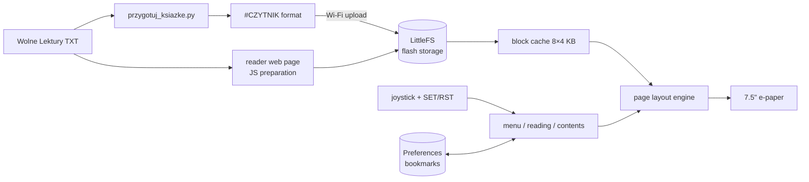

# 📖 DIY E-Paper E-Book Reader

🇬🇧 **English** · 🇵🇱 [Polski](README.pl.md)

An e-book reader built from scratch. A Python pipeline prepares the books, firmware with its own page layout engine runs on an ESP32-S3, and the case was designed in OpenSCAD and 3D-printed.


---

## ✨ Features

- **Real typesetting:** justified prose paragraphs, indentation, wrapping of over-long verse lines, preserved stanza breaks in poetry
- **Automatic prose vs. poetry detection** based on line-length statistics
- **Chapters and table of contents:** every chapter starts on a new page, navigated with a joystick
- **4 font sizes** with full Polish character support; after a size change the reader stays at the same place in the text
- **Bookmarks:** the reader remembers your position in every book, even after a power cut
- **Power saving:** deep sleep after 30 minutes of inactivity or on a long button press; waking up goes straight back to the last page
- **Wi-Fi mode:** a web page for uploading and deleting books and for over-the-air (OTA) firmware updates, no cable needed
- **Captive portal:** with no home network available, the reader starts its own access point and phones open its page automatically
- **Bonus: tic-tac-toe** for two phones, with the board drawn on the e-paper 🎮

---

## 🐍 Python: book preparation pipeline

[`przygotuj_ksiazke.py`](przygotuj_ksiazke.py) ("prepare book") converts raw TXT files from [Wolne Lektury](https://wolnelektury.pl) (a Polish public-domain library) into a lightweight format the reader understands.

```bash
python przygotuj_ksiazke.py
```
```
Pan Tadeusz: 10742 linii, 479913 bajtów -> ksiazki_do_wgrania/pan_tadeusz.txt
Treny: 699 linii, 28279 bajtów -> ksiazki_do_wgrania/treny.txt
```

What the script does:

| Step | How |
|---|---|
| Strips the license footer | finds the `-----` separator |
| Detects the books (chapters) of *Pan Tadeusz* | a regular expression for "Księga pierwsza … dwunasta" and "Epilog" |
| Tells a chapter subtitle from its summary | heuristic based on line length and indentation |
| Assembles *Treny* from 20 separate files | `pathlib.glob` plus splitting each heading into title and subtitle |
| Generates a title page | a function taking `*args` for any number of subtitles |
| Adapts the text to microcontroller fonts | a replacement table for typographic characters (`—`, `„`, `…`) |
| Normalizes whitespace | collapses blank lines, forces LF line endings, UTF-8 |

Adding a new book takes one entry in the `KSIAZKI` list and a function that returns a list of lines.

The same logic is also ported to JavaScript on the reader's web page ([`strona.h`](sketch_oct1a/strona.h)), so a plain TXT file can be uploaded straight from a phone. The Python script handles the unusual structure of *Pan Tadeusz* and *Treny* better.

### Book file format

The first line is a header. In the text after it, the first byte of each line can be a control marker:

```
#CZYTNIK|Pan Tadeusz|Adam Mickiewicz
\004Pan Tadeusz
\001Księga pierwsza
\002Gospodarstwo
\003Powrót panicza - Spotkanie się pierwsze w pokoiku, drugie u stołu - ...

    Litwo! Ojczyzno moja! ty jesteś jak zdrowie:
```

| Marker | Meaning |
|---|---|
| `\001` | chapter title (always starts a new page) |
| `\002` | chapter subtitle |
| `\003` | chapter summary (smaller font, wrapped) |
| `\004` | large title (title page) |
| `\005` | centered text |
| `\006` | prose paragraph (indented and justified) |
| *(none)* | line of verse |
| empty line | gap between stanzas |

The format is deliberately simple. The reader doesn't have to parse HTML or EPUB, and a single pass over the file is enough to find the chapters and split the text into pages.

---

## 🏗️ Architecture



### Firmware highlights

- **Books larger than RAM:** *Pan Tadeusz* is about 480 KB, so the text is read from flash in 4 KB blocks and the 8 most recently used blocks are kept in an LRU cache.
- **Custom text measurement:** asking the graphics library to measure every word was too slow, so glyph advance widths (up to U+017F, which covers all Polish letters) are computed once and cached for each font.
- **Re-pagination:** when the font size changes, the whole book is split into pages again and the reader returns to the same position in the text, not the same page number.
- **Bookmarks in NVS:** `Preferences` keys are limited to 15 characters, so file names are hashed with FNV-1a. Bookmarks from an older firmware version are migrated automatically.
- **Safe uploads:** an uploaded file is written under a temporary name and only swapped in once complete, so an interrupted upload never corrupts an existing book. File names are sanitized to `a-z0-9_-`.
- **E-paper refresh strategy:** fast partial refresh when turning pages and a full refresh every 20 pages to clear ghosting.

---

## 🔧 Hardware

| Part | Model |
|---|---|
| Microcontroller | ESP32-S3-DevKitC-1 |
| Display | Waveshare e-Paper 7.5" 800×480 (GDEY075T7) + HAT |
| Controls | 5-way joystick + SET + RST |
| Power | LiPo 523450 + TP4056 USB-C charger |

<details>
<summary>Wiring</summary>

| Signal | GPIO |
|---|---|
| e-paper CS / DC / RST / BUSY | 8 / 9 / 10 / 4 |
| e-paper SCK / MOSI | 18 / 17 |
| UP / DWN / LFT / RHT / MID | 5 / 6 / 7 / 15 / 16 |
| SET / RST | 21 / 47 |

Buttons pull to GND (internal pull-ups).
</details>

### Controls

| Button | Reading | Menu | Contents |
|---|---|---|---|
| UP / DWN | previous / next page | select book | select chapter |
| LFT | chapter start / previous chapter | last read book | back |
| RHT | next chapter | open | go to |
| MID | menu (hold: sleep) | open | go to |
| SET | table of contents | — | back |
| RST | font size | — | — |

---

## 🖨️ Case

A parametric OpenSCAD design: [`czytnik_eink.scad`](projekt%20obudowy/files/czytnik_eink.scad). Every dimension is a variable: panel size, tolerances, positions of the battery, ESP32 and charger, the USB-C ports and the rear button. That makes it easy to adapt the case to a different display.

It prints as three parts: the front bezel, a support plate behind the panel and the back cover. Ready-made STL and OBJ files are included.

---

## 🚀 Getting started

1. **Arduino IDE** with ESP32 support and the `GxEPD2` and `U8g2_for_Adafruit_GFX` libraries.
2. Board: *ESP32S3 Dev Module*. Pick a **Partition Scheme** with OTA and SPIFFS, e.g. *Default 4MB with spiffs (1.2MB APP/1.5MB SPIFFS)*.
3. Flash the sketch from [`sketch_oct1a/`](sketch_oct1a/).
4. Prepare the books: `python przygotuj_ksiazke.py`.
5. On the reader, choose **Wgraj książki (WiFi)** ("Upload books"), open the address shown on screen (or `http://czytnik.local`) and upload the files from `ksiazki_do_wgrania/`.

Later firmware versions can be uploaded through the same page (a `.bin` file) or from the Arduino IDE over the network port.

---

## 📁 Project structure

```
├── przygotuj_ksiazke.py      # Python: Wolne Lektury TXT -> reader format
├── PanTadeusz_WolneLektury.txt
├── treny_czesci/             # Treny source, 20 files
├── ksiazki_do_wgrania/       # script output, ready to upload
├── sketch_oct1a/
│   ├── sketch_oct1a.ino      # main program: layout, menu, bookmarks, sleep
│   ├── siec.ino              # Wi-Fi, web server, uploads, OTA, captive portal
│   ├── strona.h              # web page (HTML/CSS/JS in PROGMEM)
│   ├── gra.ino / gra.h       # tic-tac-toe
└── projekt obudowy/
    ├── files/                # OpenSCAD + STL + preview
    └── files obj/            # the same parts as OBJ
```

The code and its comments are in Polish.

---

## 🛠️ Tech stack

**Python** (pathlib, re) · **C++ / Arduino** (ESP32-S3, LittleFS, NVS, deep sleep) · **GxEPD2, U8g2** · **HTML / CSS / JavaScript** · **WebServer, DNSServer, mDNS, ArduinoOTA** · **OpenSCAD** · 3D printing

## 📜 License and sources

The texts of *Pan Tadeusz* (Adam Mickiewicz) and *Treny* (Jan Kochanowski) come from [Wolne Lektury](https://wolnelektury.pl) and are in the public domain.
