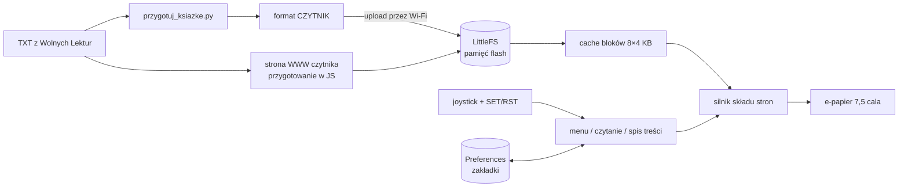

# 📖 Czytnik e-booków DIY na e-papierze

🇬🇧 [English](README.md) · 🇵🇱 **Polski**

[](https://github.com/PawelWozniak1/eink-ebook-reader/actions/workflows/tests.yml)

Własny czytnik książek zbudowany od zera — od przetwarzania tekstu w Pythonie, przez firmware z silnikiem składu stron, po obudowę zaprojektowaną w OpenSCAD i wydrukowaną w 3D.


<sub>Strony narysowane przez symulator w Pythonie fontami z czytnika: strona tytułowa, początek księgi z podtytułem i streszczeniem oraz zwykła strona ze stopką.</sub>

---

## ✨ Co potrafi

- **Czytanie z prawdziwym składem tekstu** — justowanie akapitów prozy, wcięcia, łamanie zbyt długich wersów, zachowane zwrotki w poezji
- **Automatyczne rozpoznanie prozy i wiersza** — na podstawie statystyki długości linii
- **Rozdziały i spis treści** — każdy rozdział od nowej strony, nawigacja joystickiem
- **4 rozmiary czcionki** z pełnymi polskimi znakami; po zmianie czytnik zostaje w tym samym miejscu tekstu
- **Zakładki** — czytnik pamięta miejsce w każdej książce, także po wyłączeniu zasilania
- **Oszczędzanie energii** — deep sleep po 30 min bezczynności lub na przytrzymanie przycisku, wybudzenie przyciskiem prosto na ostatnią stronę
- **Stan baterii** w menu biblioteki: procent albo błyskawica podczas ładowania, automatyczne uśpienie przy rozładowanej baterii
- **Tryb Wi-Fi** — strona w przeglądarce do wgrywania i usuwania książek oraz aktualizacji firmware'u (OTA) bez kabla
- **Captive portal** — gdy nie ma domowej sieci, czytnik tworzy własną, a telefon sam otwiera jego stronę
- **Bonus: kółko i krzyżyk** na dwa telefony, z planszą rysowaną na e-papierze 🎮

---

## 🐍 Python: przygotowanie książek

[`przygotuj_ksiazke.py`](tools/przygotuj_ksiazke.py) zamienia surowe pliki TXT z [Wolnych Lektur](https://wolnelektury.pl) na lekki format zrozumiały dla czytnika.

```bash
python tools/przygotuj_ksiazke.py
```
```
Pan Tadeusz: 10742 linii, 479913 bajtów -> books/prepared/pan_tadeusz.txt
Treny: 699 linii, 28279 bajtów -> books/prepared/treny.txt
```

Co robi skrypt:

| Krok | Jak |
|---|---|
| Wycina stopkę licencyjną | wyszukanie separatora `-----` |
| Rozpoznaje księgi *Pana Tadeusza* | wyrażenie regularne dla „Księga pierwsza … dwunasta” i „Epilog” |
| Odróżnia podtytuł od streszczenia księgi | heurystyka: długość linii i brak wcięcia |
| Składa *Treny* z 20 osobnych plików | `pathlib.glob` + rozbicie tytułu na tytuł i podtytuł |
| Generuje stronę tytułową | funkcja z `*args` na dowolną liczbę podtytułów |
| Dopasowuje tekst do czcionek mikrokontrolera | tablica zamian typograficznych znaków (`—`, `„`, `…`) |
| Normalizuje białe znaki | scalanie pustych linii, LF zamiast CRLF, UTF-8 |

Dodanie nowej książki to jedna linia w liście `KSIAZKI` i funkcja zwracająca listę linii.

Ta sama logika jest też przepisana na JavaScript w stronie czytnika ([`strona.h`](firmware/czytnik/strona.h)), więc zwykły plik TXT można wgrać prosto z telefonu — skrypt w Pythonie lepiej radzi sobie jednak z nietypową strukturą *Pana Tadeusza* i *Trenów*.

### Format pliku książki

Pierwsza linia to nagłówek, dalej tekst, w którym pierwszy bajt linii może być znacznikiem:

```
#CZYTNIK|Pan Tadeusz|Adam Mickiewicz
\004Pan Tadeusz
\001Księga pierwsza
\002Gospodarstwo
\003Powrót panicza - Spotkanie się pierwsze w pokoiku, drugie u stołu - ...

    Litwo! Ojczyzno moja! ty jesteś jak zdrowie:
```

| Znacznik | Znaczenie |
|---|---|
| `\001` | tytuł rozdziału (zawsze od nowej strony) |
| `\002` | podtytuł rozdziału |
| `\003` | streszczenie (mniejsza czcionka, zawijane) |
| `\004` | duży tytuł (strona tytułowa) |
| `\005` | tekst wyśrodkowany |
| `\006` | akapit prozy (wcięty i wyjustowany) |
| *(brak)* | wers wiersza |
| pusta linia | odstęp między zwrotkami |

Format jest celowo prosty: czytnik nie musi parsować HTML ani EPUB-a, a jedno przejście po pliku wystarcza, żeby znaleźć rozdziały i podzielić tekst na strony.

---

## 🖥️ Python: symulator czytnika

[`tools/symulator/`](tools/symulator/) składa książkę dokładnie tak, jak pokaże ją czytnik, i zapisuje strony jako PNG. To przeniesiony do Pythona silnik składu stron z firmware'u, więc wygląd książki można sprawdzić bez wgrywania czegokolwiek.

```bash
pip install -r requirements.txt
python tools/symulator/czytnik.py books/prepared/pan_tadeusz.txt -s 0 1 2 -m podglad.png
```
```
Pan Tadeusz: 308 stron, 13 rozdziałów, wiersz, czcionka średnia
-> podglad.png
```


<sub>Tren I w czcionce małej, średniej i bardzo dużej. Zbyt długie wersy zawijają się z wcięciem, a liczba stron w stopce zmienia się razem z rozmiarem czcionki.</sub>

Jak to działa:

- **Dekoder fontów u8g2** ([`u8g2_font.py`](tools/symulator/u8g2_font.py)). Fonty z firmware'u to fonty bitmapowe zapisane w pliku C jako tablice bajtów skompresowane kodowaniem długości serii (RLE) na poziomie bitów. Dekoder parsuje literały napisów C (escape'y ósemkowe i szesnastkowe), czyta 23-bajtowy nagłówek, wyszukuje glify w listach ASCII i tablicy skoków Unicode, a potem rozpakowuje bitmapy. Szerokość tekstu liczy dokładnie tak jak biblioteka, łącznie z jej osobliwościami, np. ostatni znak liczony jest szerokością bitmapy, a nie przesunięciem kursora.
- **Port silnika składu** ([`czytnik.py`](tools/symulator/czytnik.py)). Kod odwzorowuje `ulozStrone`, `podzielNaStrony` i `rysujStrone` z firmware'u i tak jak C++ operuje na pozycjach bajtów w UTF-8. Zakładka zapisana przez czytnik wskazuje więc to samo miejsce w symulatorze.
- **CLI** w `argparse`: wybór stron, rozmiaru czcionki, folderu wyjściowego albo jednego obrazka ze stronami obok siebie.
- **Testy** ([`tests/`](tests/)) uruchamiane w GitHub Actions. Sprawdzają czytnik bitów, parser literałów C, polskie litery we wszystkich fontach, pomiar tekstu i niezmienniki podziału na strony: strony pokrywają cały tekst, każdy rozdział zaczyna się od nowej strony, a większa czcionka daje więcej stron.

Obrazki w README generuje `python tools/symulator/zrzuty_do_readme.py`.

---

## 🔌 Firmware

Kod Arduino jest w folderze [`firmware/czytnik/`](firmware/czytnik/). To ok. 1900 linii C++, HTML i JavaScriptu:

| Plik | Co zawiera |
|---|---|
| [`czytnik.ino`](firmware/czytnik/czytnik.ino) | pętla główna, przyciski, cache bloków, silnik składu, justowanie, menu, spis treści, zakładki, deep sleep |
| [`bateria.ino`](firmware/czytnik/bateria.ino) | pomiar napięcia baterii (ADC), procent z krzywej rozładowania LiPo, wykrywanie ładowarki, ochrona przed głębokim rozładowaniem |
| [`siec.ino`](firmware/czytnik/siec.ino) | Wi-Fi (domowa sieć albo własna), serwer WWW, wgrywanie i usuwanie książek, aktualizacja programu, ArduinoOTA, captive portal |
| [`strona.h`](firmware/czytnik/strona.h) | strona do wgrywania (HTML/CSS/JS w `PROGMEM`), razem z przygotowywaniem książek w JS |
| [`gra.ino`](firmware/czytnik/gra.ino) / [`gra.h`](firmware/czytnik/gra.h) | kółko i krzyżyk na dwa telefony: stan gry, miejsca graczy z wygasaniem, plansza na e-papierze |

---

## 🏗️ Architektura



### Ciekawsze rozwiązania w firmware

- **Książka większa niż RAM** — *Pan Tadeusz* ma ~480 KB, więc tekst jest czytany z flasha blokami po 4 KB, a 8 ostatnio używanych bloków trzymanych jest w cache'u LRU.
- **Własny pomiar szerokości tekstu** — mierzenie przez bibliotekę przy każdym słowie było zbyt wolne, więc szerokości znaków (do U+017F, czyli z polskimi literami) są liczone raz i zapamiętywane dla każdej czcionki.
- **Paginacja z przeliczaniem** — przy zmianie czcionki cała książka jest dzielona na strony na nowo, a czytnik wraca do tego samego miejsca w tekście, nie do tego samego numeru strony.
- **Zakładki w NVS** — klucze w `Preferences` mogą mieć maks. 15 znaków, więc nazwa pliku jest zamieniana na hash FNV-1a; jest też migracja zakładek ze starszej wersji firmware'u.
- **Bezpieczny upload** — plik zapisuje się pod tymczasową nazwą i dopiero po skończeniu podmienia, więc przerwane wgrywanie nie psuje istniejącej książki. Nazwy plików są czyszczone ze znaków spoza `a-z0-9_-`.
- **Odświeżanie e-papieru** — szybkie częściowe odświeżanie przy przewracaniu stron i pełne co 20 stron, żeby nie zostawały powidoki.

---

## 🔧 Sprzęt

| Element | Model |
|---|---|
| Mikrokontroler | ESP32-S3-DevKitC-1 |
| Wyświetlacz | Waveshare e-Paper 7,5" 800×480 (GDEY075T7) + HAT |
| Sterowanie | joystick 5-kierunkowy + SET + RST |
| Zasilanie | LiPo 523450 1000 mAh + ładowarka TP4056 (USB-C) + przetwornica Pololu S7V8F3 (3,3 V) |

<details>
<summary>Podłączenie</summary>

| Sygnał | GPIO |
|---|---|
| e-papier CS / DC / RST / BUSY | 8 / 9 / 10 / 4 |
| e-papier SCK / MOSI | 18 / 17 |
| UP / DWN / LFT / RHT / MID | 5 / 6 / 7 / 15 / 16 |
| SET / RST | 21 / 47 |
| napięcie baterii (dzielnik 100k/100k z TP4056 OUT+) | 1 |
| ładowarka podłączona (dzielnik 100k/100k z TP4056 IN+) | 2 |

Przyciski zwierają do GND (wewnętrzne pull-upy). Nowsze HAT-y mają 9. pin PWR: idzie razem z VCC na 3V3, więc ekran jest zasilany cały czas.

Zasilanie: bateria → TP4056 (B+/B−) → OUT+/OUT− → Pololu S7V8F3 (VIN/GND) → VOUT na pin **3V3** ESP32. Pin 5V zostaje pusty. Przy wgrywaniu programu kablem USB baterię trzeba odłączyć.

Dzielniki do pomiaru baterii są opcjonalne: bez nich czytnik działa, tylko nie pokazuje stanu baterii. Jak je zbudować: [`docs/dzielnik_baterii.md`](docs/dzielnik_baterii.md).
</details>

<details>
<summary>Rozmieszczenie w obudowie</summary>

Czytnik trzyma się pionowo. Opis jest od przodu, tak jak patrzysz na tekst:

| Element | Gdzie |
|---|---|
| joystick (z SET i RST) | w tylnej klapce, z lewej u góry, grzybkiem na zewnątrz |
| TP4056 | przy prawej krawędzi, u góry, gniazdo USB-C w prawej ściance |
| przetwornica Pololu | poziomo pod ładowarką, pinami w stronę środka |
| bateria | u góry, między joystickiem a ładowarką |
| HAT | przy prawej krawędzi, na wysokości taśmy FPC (środek prawej krawędzi matrycy) |
| ESP32 | na dole, na środku, gniazda USB w dolnej ściance, antena do góry |
| dzielniki | na małej płytce tuż obok GPIO1 i GPIO2 |

Przewody przycisków schodzą jednym pasem wzdłuż lewej krawędzi i przechodzą pod płytką ESP do prawej listwy, więc ESP stoi na listwach z 2–3 mm prześwitu. Rysunek z wszystkimi przewodami, kolorami i tabelą połączeń: [`docs/okablowanie.html`](docs/okablowanie.html) (pobierz i otwórz w przeglądarce).
</details>

### Obsługa

| Przycisk | Czytanie | Menu | Spis treści |
|---|---|---|---|
| UP / DWN | poprzednia / następna strona | wybór książki | wybór rozdziału |
| LFT | początek / poprzedni rozdział | ostatnio czytana | powrót |
| RHT | następny rozdział | otwórz | przejdź |
| MID | menu (przytrzymanie: uśpij) | otwórz | przejdź |
| SET | spis treści | — | powrót |
| RST | rozmiar czcionki | — | — |

---

## 🖨️ Obudowa


Projekt parametryczny w OpenSCAD: [`czytnik_eink.scad`](hardware/case/czytnik_eink.scad). Wszystkie wymiary (panel, luzy, położenie baterii, ESP32 i ładowarki, gniazda USB-C, przycisk z tyłu) są zmiennymi, więc obudowę łatwo dopasować do innego egzemplarza wyświetlacza.

Trzy części do druku: przednia ramka, płytka podporowa pod panel i tylna klapka. Gotowe pliki są w formatach STL i OBJ.

> Projekt obudowy odpowiada jeszcze wcześniejszemu rozmieszczeniu elektroniki. Nowy układ (joystick w klapce, gniazdo ładowania w prawej ściance, ESP na dole) opisuje [`docs/okablowanie.html`](docs/okablowanie.html).

---

## 🚀 Uruchomienie

1. **Arduino IDE** z obsługą ESP32 oraz bibliotekami `GxEPD2` i `U8g2_for_Adafruit_GFX`.
2. Płytka: *ESP32S3 Dev Module*, **Partition Scheme** z OTA i SPIFFS, np. *Default 4MB with spiffs (1.2MB APP/1.5MB SPIFFS)*.
3. Wgraj szkic z folderu [`firmware/czytnik/`](firmware/czytnik/).
4. Przygotuj książki: `python tools/przygotuj_ksiazke.py`. Możesz je obejrzeć w symulatorze.
5. Na czytniku wybierz **Wgraj książki (WiFi)**, otwórz w przeglądarce adres z ekranu (albo `http://czytnik.local`) i wgraj pliki z `books/prepared/`.

Kolejne wersje firmware'u można wgrywać przez tę samą stronę (plik `.bin`) albo z Arduino IDE przez port sieciowy.

---

## 📁 Struktura

```
├── books/
│   ├── source/                    # wejście: TXT z Wolnych Lektur (Pan Tadeusz, 20 plików z Trenami)
│   └── prepared/                  # wyjście: format #CZYTNIK, gotowe do wgrania
├── tools/
│   ├── przygotuj_ksiazke.py       # Python: źródłowy TXT -> format czytnika
│   └── symulator/
│       ├── czytnik.py             # port silnika składu + CLI
│       ├── u8g2_font.py           # dekoder fontów bitmapowych u8g2
│       ├── fonty/                 # 6 fontów używanych przez firmware
│       └── zrzuty_do_readme.py    # generuje docs/*.png
├── firmware/czytnik/              # szkic Arduino (otwórz czytnik.ino)
│   ├── czytnik.ino                # główny program: skład stron, menu, zakładki, usypianie
│   ├── bateria.ino                # stan baterii i ładowania
│   ├── siec.ino                   # Wi-Fi, serwer WWW, upload, OTA, captive portal
│   ├── strona.h                   # strona WWW (HTML/CSS/JS w PROGMEM)
│   └── gra.ino / gra.h            # kółko i krzyżyk
├── hardware/case/                 # projekt OpenSCAD, podgląd, stl/, obj/
├── tests/                         # testy unittest, uruchamiane w GitHub Actions
└── docs/                          # obrazki do README, rysunek okablowania, instrukcja dzielnika
```

---

## 🛠️ Technologie

**Python** (pathlib, re, Pillow, argparse, dataclasses, unittest) · **GitHub Actions** · **C++ / Arduino** (ESP32-S3, LittleFS, NVS, deep sleep) · **GxEPD2, U8g2** · **HTML / CSS / JavaScript** · **WebServer, DNSServer, mDNS, ArduinoOTA** · **OpenSCAD** · druk 3D

## 📜 Licencja i źródła

Teksty *Pana Tadeusza* i *Trenów* pochodzą z [Wolnych Lektur](https://wolnelektury.pl) i należą do domeny publicznej.

Fonty bitmapowe w `tools/symulator/fonty/` pochodzą z projektu [u8g2](https://github.com/olikraus/u8g2), który rozpowszechnia je na ich oryginalnych licencjach X11/Adobe.
